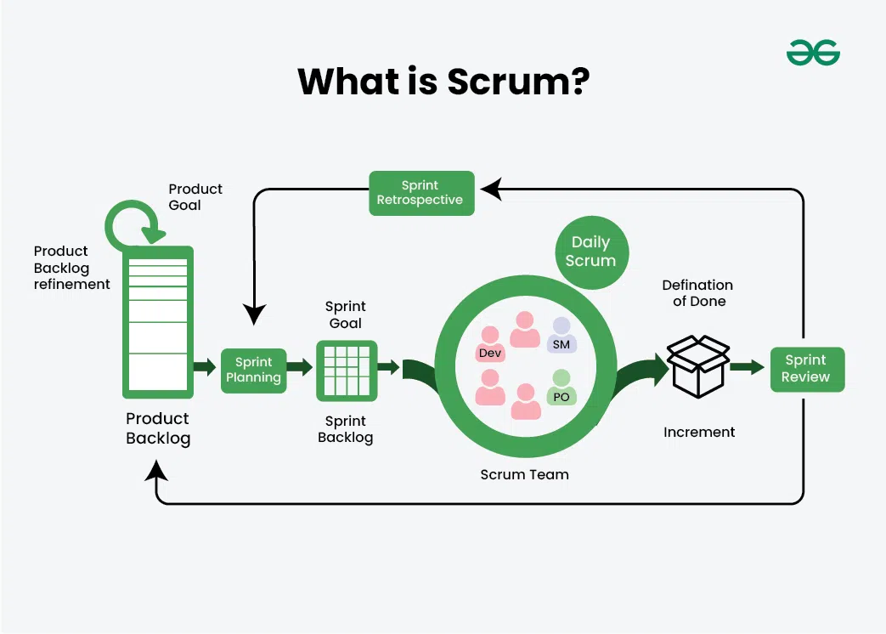

# 📌 1. På feature-branchen

git add .
git commit -m "text"
git push -u origin (branch)

# 🔁 2. Merga in i dev

git checkout dev
git pull
git merge (branch) -m "text" # konflikter kan uppstå
git push origin dev

# 🚀 3. Merga dev in i main

git checkout main
git pull
git merge dev -m "text"
git push origin main

---

🧩 Roller (veckovis) ↓

👑 Product Owner (PO)
Ansvarar för vad som ska byggas och i vilken ordning.
Ser till att kraven och backloggen är tydliga och prioriterade.

🧭 Scrum Master
Ansvarar för Scrum-processen och mötena.
Ser till att teamet kan arbeta utan hinder.

💻 Development Team
Ansvarar för att koda och leverera funktionerna i produkten.
Delar upp arbete, bygger, testar och visar resultatet.

---

📌 Definition of Done

✔ Kod fungerar utan console-errors
✔ Funktionen uppfyller beskrivnings kriterierna
✔ Felhantering finns (catch + UI-feedback)
✔ Kod pushad på GitHub + PR godkänd
✔ Testad i desktop + mobil läge

---

??? Estimera med Story Points ???

---

📆 Arbetsupplägg per sprint/vecka

Måndag 🟣 - Sprint Planning – välja user stories för veckan, dela upp dem vid behov, uppdatera backlog.

Tisdag 🕒 - Daily Scrum + utveckling under dagen.

Onsdag 🕒 - Daily Scrum + utveckling under dagen.

Torsdag 🕒 - Daily Scrum + utveckling under dagen.

Fredag 🔄 - Daily Scrum + Sprint Retrospektiv + (maybe) förberedelse inför nästa sprint.
.

---

🕒 Daily Scrum (varje dag (förutom måndag), tid 09:00)

Varje morgon håller vi ett kort möte där alla svarar på tre frågor:
.
🔹 Vad gjorde jag igår?
🔹 Vad ska jag göra idag?
🔹 Finns det hinder?

👉 Syfte: ge teamet överblick, identifiera problem tidigt.

⏱️ Max 15 minuter

---

🟣 Sprint Planning (varje måndag, 09:00 eller när tid finns)

Vi delar upp olika roller för veckan

Product Owner väljer vilka stories som är viktigast och som ska prioriteras.

Vi väljer userstories vi tror vi hinner med under sprinten.

Stories bryts ner i tasks ifall de behövs. Tasks skrivs i beskrivningen under User Storien.

🎯 Målet är att varje sprint ska resultera i en färdig och fungerande del av produkten som går att demonstrera.

---

?? Sprint review ??

---

🔄 Sprint Retrospektiv (varje fredag, tid 14:00)

När sprinten är klar gör vi en kort återblick för att tillsammans förbättra vårt arbetssätt. Kolla vad som gick bra/dåligt.

💚 Vad gick bra?
🚧 Vad kan förbättras?
🧪 Vad testar vi nästa sprint? (t.ex. bättre commits, prata mer, skriva tydligare tasks)

👉 Syftet är att utveckla vårt arbetssätt tillsammans och göra små förbättringar varje sprint (inte att hitta fel hos personer)
